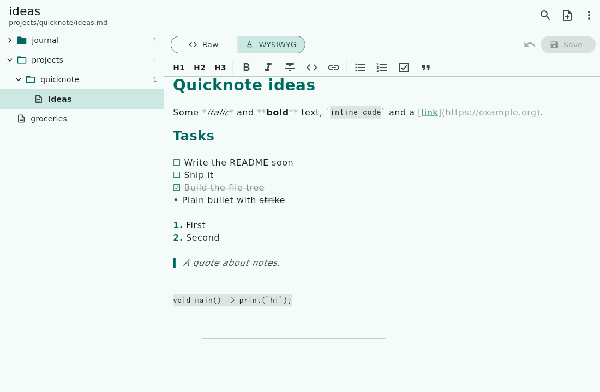

# Quicknote


Tiny GUI app to browse and edit a folder of Markdown notes. A sibling of
[Quicklog](https://github.com/snonux/quicklog) built on the same Flutter stack,
targeting Android (primary) and Linux desktop (development). Where Quicklog
jots new timestamped notes, Quicknote edits the notes you already have: point
it at a folder (say, the one Syncthing keeps in sync with your laptop) and
every `.md` file in it is one tap away.



## Features

- **Notes folder**: any directory, configured in Preferences. Every `.md` and
  `.markdown` file in it and its subfolders is a note. Folders starting with
  `.` (`.git`, `.obsidian`, `.stfolder`) are skipped, and links are not
  followed. On Android, a folder picked with the system picker needs no
  storage permission.
- **File tree** of the folder, folders first, each with its note count.
  Long-press or right-click a note to rename/move or delete it.
- **Fuzzy finder** (search icon, `Ctrl+P` or `Ctrl+K`): type a few letters of
  a note's path, in order, to find it; `qnidea` finds
  `projects/quicknote/ideas.md`. Space-separated words must all match.
  Arrows or `Ctrl+N`/`Ctrl+P` move, Enter opens.
- **Two editors**, switched with the Raw / WYSIWYG toggle or `Ctrl+E`:
  - **Raw**: the Markdown source exactly as it is on disk, in a monospace
    font.
  - **WYSIWYG**: headings, bold, italics, strikethrough, inline code, links,
    bullet and numbered lists, tasks (☐ / ☑), quotes, code blocks and rules
    are shown formatted as you type, and their syntax characters are hidden,
    except on the line you are editing, where they show dimmed (like Typora
    or Obsidian's live preview). A toolbar adds headings, emphasis, links,
    lists, tasks and quotes; Enter continues a list. `Ctrl+B` / `Ctrl+I`
    work in both editors.

  Both editors work on the same Markdown text. The WYSIWYG view only changes
  how the text is painted, so switching between them, or saving from either,
  never rewrites a note's formatting. The editor you used last is remembered.
- **Saving** (`Ctrl+S`) writes back to the same file, atomically on a plain
  directory (temp file + rename). If the file changed on disk since you
  opened it, for example because Syncthing delivered an edit from another
  device, Quicknote asks before overwriting it. Leaving a note with unsaved
  edits asks first, too.
- **New notes** (`Ctrl+N`) go into the folder of the open note by default;
  type a path such as `projects/todo` and missing folders are created and
  `.md` is added.
- **Layouts**: on wide windows the tree and the editor sit side by side; on a
  phone a note opens on its own screen.
- **No network**: no S3, no accounts, no telemetry. The Android release build
  does not even request the `INTERNET` permission.

### Why not a rich-text editor package?

The Flutter WYSIWYG editors that convert Markdown into their own document
model (AppFlowy Editor, Super Editor) do not compile against current Flutter,
and the one that does (Quill) loses formatting on a round trip: it escapes
punctuation, drops blank lines and flattens tables. For a tool whose whole job
is editing someone's existing notes, a lossy save is not acceptable, so the
WYSIWYG view is a styled view of the Markdown source instead
(`lib/editor/markdown_styler.dart`).

## Install on Android

There is no published build yet. Build the APK yourself as below and install
it with `adb install`. The release pipeline (signed per-ABI APKs on a `vX.Y.Z`
tag, F-Droid-style version codes) is set up the same way as Quicklog's; see
[AGENTS.md](./AGENTS.md).

## Releases

Versions live in a single place: the `version:` line of `pubspec.yaml`, written
as `<semver>+<buildNumber>`. The build number is a plain counter; bump it by
one per release. Android's `versionName` and `versionCode` are derived from it,
and every release commit gets a matching `vX.Y.Z` git tag. The About dialog
reads the same line at runtime: `pubspec.yaml` is bundled as an asset and
parsed by `lib/services/app_version.dart`.

Split APKs do not carry that number verbatim: `android/app/build.gradle.kts`
turns it into `buildNumber * 10 + abi`, with 1, 2 and 3 for armeabi-v7a,
arm64-v8a and x86_64, so `0.1.0+1` ships as 11 / 12 / 13.

Store text lives in `fastlane/metadata/android/en-US/`. `.flutter-version`
pins the Flutter SDK a release is built with.

## Requirements

- [Flutter](https://flutter.dev) stable channel (3.47+; see `.flutter-version`).
- For Android builds: Android SDK + JDK 17 or 21 (Gradle 8.14 rejects 25+):
  `flutter config --jdk-dir=$HOME/jdk21`.
- For Linux desktop builds: `gtk3-devel`, `clang`, `cmake`, `ninja-build`,
  `pkg-config`, `xz-devel` (Fedora names).

## Build and Run

### Linux desktop

```sh
flutter run -d linux              # dev with hot reload
flutter build linux --release     # release bundle: build/linux/x64/release/bundle/
```

The default notes folder on Linux is `~/Notes`.

### Android

```sh
flutter run -d <device-id>                    # dev on a connected device
flutter build apk --release --split-per-abi   # per-ABI release APKs
adb install -r build/app/outputs/flutter-apk/app-arm64-v8a-release.apk
```

### Tests

```sh
flutter analyze
flutter test
```

CI (`.github/workflows/ci.yml`, for now in `docs/workflows/`) runs both and builds the Android and Linux
release targets on every push and pull request.

## Storage on Android

By default notes live in the app-specific external directory,
`/Android/data/org.buetow.quicknote/files/`, which needs no permission (and is
removed on uninstall). For an existing notes vault use **Preferences → Choose
folder with Android picker**: Android grants access to just that folder. A
typed path into shared storage needs Storage permission on Android 7–10, or
"All files access" on Android 11+; Preferences says so and links to the
setting when the folder is not writable.
