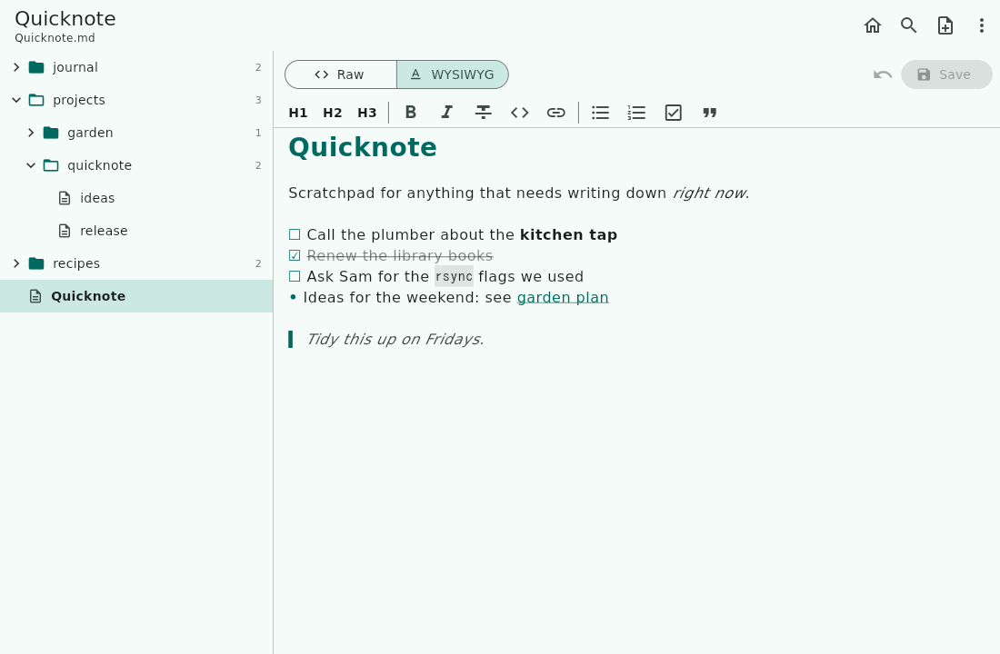

# Quicknote


Quicknote is a small app for browsing and editing a folder of Markdown notes,
on Android and Linux. Point it at a folder, for example one Syncthing keeps in
sync with your laptop, and every `.md` file in it is one tap away. It is a
sibling of [Quicklog](https://github.com/snonux/quicklog), built on the same
Flutter stack. Quicklog jots down new notes; Quicknote edits the ones you
already have.



**[Read the usage guide](docs/usage.md)** for a full tour with screenshots.

## Features

- **File tree** of the notes folder and all its subfolders, with a
  right-click or long-press menu to rename, move and delete notes.
- **Fuzzy finder** (`Ctrl+P`): `qnrel` finds `projects/quicknote/release.md`.
- **Default note**: the home button (`Ctrl+D`) opens `Quicknote.md`, ready
  for typing. The note is configurable.
- **Raw and WYSIWYG editors** on the same Markdown text, switched with
  `Ctrl+E`. WYSIWYG shows formatting as you type and never rewrites a note.
- **Autosave** when you switch notes, leave the app or close the window. A
  note that changed on disk meanwhile is never overwritten silently.
- **Phone and desktop layouts**: tree and editor side by side on wide
  screens, one screen at a time on a phone.
- **No network**: no S3, no accounts, no telemetry. The Android app does not
  even request the `INTERNET` permission.

## Install

There is no published build yet. Build it yourself as below; on Android,
install the APK with `adb install`.

## Build and run

Requirements:

- [Flutter](https://flutter.dev), stable channel, version pinned in
  `.flutter-version`.
- Android: the Android SDK and JDK 17 or 21 (Gradle 8.14 rejects JDK 25):
  `flutter config --jdk-dir=$HOME/jdk21`.
- Linux: `gtk3-devel`, `clang`, `cmake`, `ninja-build`, `pkg-config` and
  `xz-devel` (Fedora package names).

```sh
# Linux desktop
flutter run -d linux                          # development, with hot reload
flutter build linux --release                 # build/linux/x64/release/bundle/

# Android
flutter run -d <device-id>                    # development on a device
flutter build apk --release --split-per-abi   # per-ABI release APKs
adb install -r build/app/outputs/flutter-apk/app-arm64-v8a-release.apk

# Checks
flutter analyze
flutter test
```

The CI workflow runs these checks and builds the Android and Linux release
targets on every push and pull request. It is in `docs/workflows/` for now and
only runs once moved to `.github/workflows/`; see the README there.

## Releases

The version lives in one place, the `version:` line of `pubspec.yaml`
(`<semver>+<buildNumber>`). Bump the build number by one per release and tag
the release commit `vX.Y.Z`. Split APKs get the version code
`buildNumber * 10 + abi`, so `0.1.0+1` ships as 11, 12 and 13. Store text and
screenshots live in `fastlane/metadata/android/en-US/`. The details, and the
traps, are in [AGENTS.md](AGENTS.md).

The logo is drawn by `tool/draw_logo.py`.

## License

MIT; see [LICENSE](LICENSE).
