# TurboNotes usage guide

TurboNotes edits a folder of plain Markdown files. This guide walks through
everything it does. The screenshots show a phone; on a tablet (and on the
Linux desktop build) the tree and the note sit side by side, as shown in
[The main screen](#the-main-screen).

- [The notes folder](#the-notes-folder)
- [The main screen](#the-main-screen)
- [The default note](#the-default-note)
- [Finding notes](#finding-notes)
- [Pinned and recent notes](#pinned-and-recent-notes)
- [Tags](#tags)
- [Editing](#editing)
- [Images](#images)
- [Saving](#saving)
- [Creating, renaming and deleting notes](#creating-renaming-and-deleting-notes)
- [Sharing a note](#sharing-a-note)
- [Quick capture on Android](#quick-capture-on-android)
- [Preferences](#preferences)
- [Storage on Android](#storage-on-android)
- [Keyboard shortcuts](#keyboard-shortcuts)
- [Vi keys](#vi-keys)
- [Why the WYSIWYG editor works the way it does](#why-the-wysiwyg-editor-works-the-way-it-does)

## The notes folder

TurboNotes works on one folder at a time, the *notes folder*. Every `.md` and
`.markdown` file in it, and in all of its subfolders, is a note. Everything
else is ignored:

- Other file types are not listed and never touched.
- Folders whose name starts with `.` (`.git`, `.obsidian`, `.stfolder`,
  `.trash`) are skipped, so a Git repository or an Obsidian vault works as a
  notes folder as is.
- Symbolic links are not followed.

On first start the notes folder is `~/Notes` on Linux and the app's own
folder on Android (see [Storage on Android](#storage-on-android)). It is
created if it does not exist. Change it in [Preferences](#preferences).

TurboNotes has no sync of its own and no network access at all. To have the
same notes on several devices, point it at a folder that a sync tool such as
Syncthing keeps in sync.

## The main screen

On a phone the main screen is the sidebar: pinned notes, recent notes, tags
and the file tree of the notes folder. Tap a note to open it on a screen of
its own; Back returns to the sidebar and saves the note on the way. Pull the
sidebar down to refresh it.

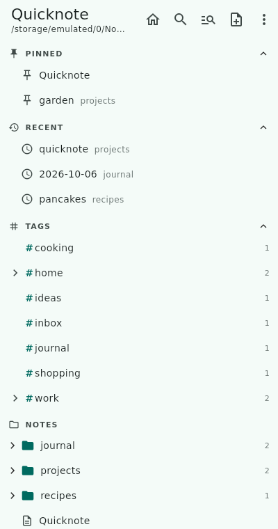

The sidebar has four sections. Tap a section's header to fold it away.

- **Pinned**: notes you [pinned](#pinned-and-recent-notes).
- **Recent**: the last few notes you opened.
- **Tags**: every [`#tag`](#tags) in your notes, with the number of notes
  using it.
- **Notes**: the file tree. Folders come first, each with the number of
  notes it holds (counting subfolders). Tap a folder to open or close it.

The title shows the notes folder, or the open note's name and its path in
the notes folder. A `•` after the name means it has unsaved edits. The
buttons on the right are, from left to right:

| Button | What it does |
|--------|--------------|
| Lightning bolt | Opens the [default note](#the-default-note) (`Ctrl+D`) |
| Search | Opens the [fuzzy finder](#fuzzy-finder) (`Ctrl+P`) |
| Search text | Opens [full-text search](#full-text-search) (`Ctrl+Shift+F`) |
| New note | [Creates a note](#creating-renaming-and-deleting-notes) (`Ctrl+N`) |
| ⋮ menu | Refresh, Collapse all folders, Preferences, About |

**Refresh** (`F5`) re-reads the notes folder. TurboNotes also refreshes on its
own whenever you come back to the app, so notes another device synced in the
meantime show up.

### On a tablet

On a wide screen, such as a tablet in landscape, the sidebar and the open note
sit side by side, and the note's actions (pin, share, rename, delete) move
into the ⋮ menu of the main screen:

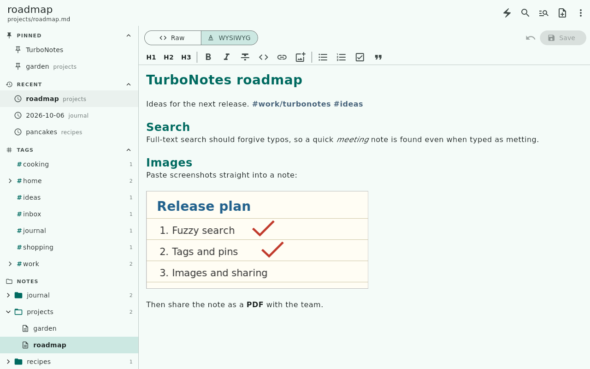

## The default note

The lightning bolt button, or `Ctrl+D`, opens the default note,
`TurboNote.md` at the top of the notes folder. It is meant as a scratchpad for
anything that needs writing down *now*: it opens with the cursor at the end,
ready for typing.

If the note does not exist yet, the bolt button creates it with a
`# TurboNote` heading. Pressing the button while the note is already open
puts the cursor back at its end.

To use another note, change **Default note** in
[Preferences](#preferences), for example to `journal/inbox.md`. The path is
relative to the notes folder; `.md` is added if you leave it out, and missing
folders are created along with the note.

## Finding notes

### File tree

Click a folder to open or close it. **Collapse all folders** in the ⋮ menu
closes them all. Opening a note in any other way, such as the fuzzy finder,
opens the folders on its path so that it is visible in the tree.

Long-press a note (right-click with a mouse) for **Pin**, **Share…**,
**Rename / move** and **Delete**:

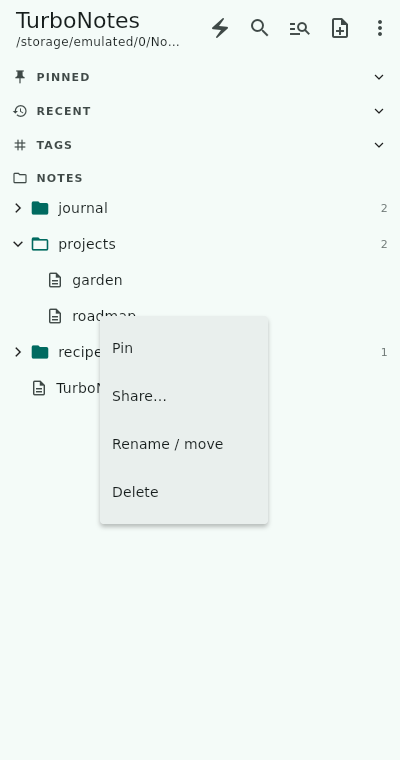

### Fuzzy finder

The search button, `Ctrl+P` or `Ctrl+K` opens the fuzzy finder. Type a few
letters of a note's path, in order, and it lists the notes that match, best
first. The letters do not have to be next to each other: `prgar` finds
`projects/garden.md`. Matched letters are highlighted. With an empty query
it lists your recent notes first.

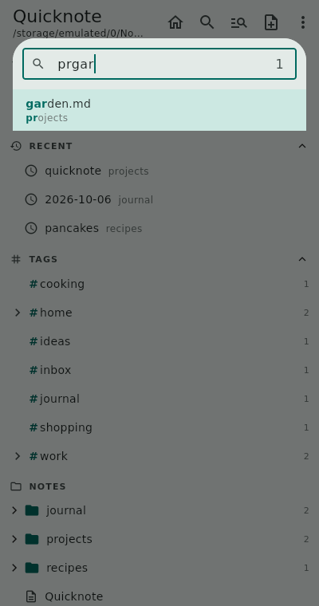

- Matches in the file name rank above matches in folder names, and letters at
  the start of a word or right after each other rank higher.
- Separate words with spaces to require all of them, in any order:
  `garden plan`.
- Use the arrow keys, `Ctrl+N` / `Ctrl+P` or `Page Up` / `Page Down` to move
  through the list, and `Enter` or a click to open a note. `Esc` closes the
  finder.
- The count on the right shows how many notes match.

### Full-text search

The search-text button (the magnifier with lines) or `Ctrl+Shift+F` searches
inside all notes. Each match shows its note and the lines it was found on,
with the matches highlighted. Pick one and the note opens with the match
selected.

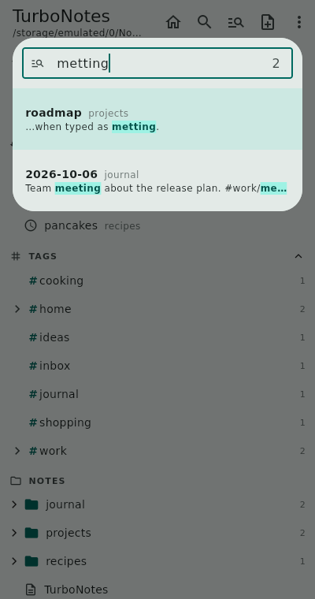

- **Typos are forgiven.** Words of four to six letters may have one typo,
  longer words two: `metting` finds `meeting`, `turbnotes` finds `turbonotes`.
  Exact matches rank first. Words of three letters or fewer must match
  exactly.
- **Several words** must all appear in a note, in any order. A word also
  matches the note's name and folder.
- **`#tag` words filter by tag**: `#work release` finds notes tagged `#work`
  (or `#work/…`) that mention *release*. `#work` on its own lists every note
  with that tag.
- The keys are the same as in the fuzzy finder.

The search reads all notes once when you first open it and keeps up with
your edits from then on.

## Pinned and recent notes

Pin the notes you use most: long-press a note in the tree and choose
**Pin**, or use **Pin** in an open note's ⋮ menu. Pinned notes stay at the
top of the sidebar until you unpin them the same way.

The **Recent** section lists the last five notes you opened, newest first.
TurboNotes remembers more of them for the fuzzy finder, which lists recent
notes first while its query is empty. Renaming a note keeps it in both
lists; deleting it removes it.

## Tags

Any word starting with `#` in a note is a tag: `#inbox`, `#shopping`,
`#work/meetings`. A `/` nests tags, so `#work/meetings` shows up under
`#work` in the sidebar. Tags are not case sensitive. Headings (`# Title`),
numbers like `#42`, and anything in `code` are not tags. Tags are coloured
in the WYSIWYG editor.

Tap a tag in the sidebar to filter the file tree down to the notes that
carry it; a tag includes its nested tags. The filter shows as a chip at the
top of the sidebar. Tap the chip's ✕ to show all notes again.

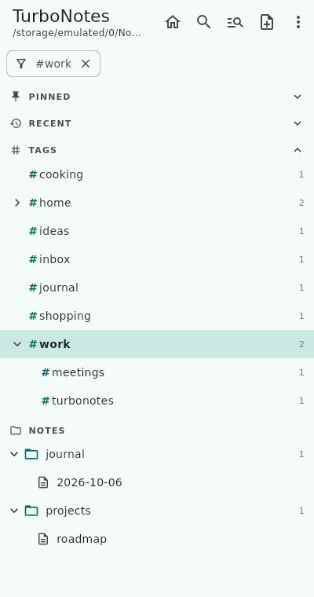

## Editing

Every note can be edited in two editors. The Raw / WYSIWYG switch above the
note, or `Ctrl+E`, flips between them. Both edit the same Markdown text, so
switching is instant and never changes the file. TurboNotes remembers the
editor you used last and opens notes in it.

### Raw

The Markdown source exactly as it is on disk, in a monospace font. Nothing is
hidden or changed.

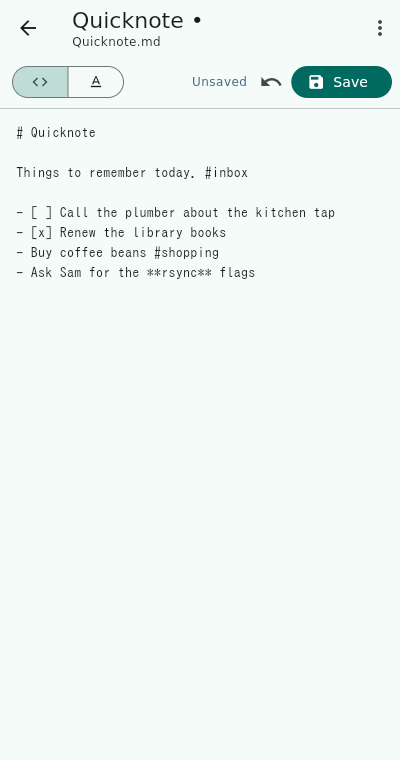

### WYSIWYG

Markdown shown formatted while you type: headings, **bold**, *italics*,
~~strikethrough~~, `inline code`, links, bullet and numbered lists, tasks,
quotes, fenced code blocks, tables and horizontal rules.

The Markdown syntax characters (`#`, `**`, `- [ ]` and so on) are hidden,
except on the line the cursor is on, where they show dimmed so that you can
see and edit them, like Typora or Obsidian's live preview:


The toolbar above the note inserts Markdown for you. With text selected,
bold, italics, strikethrough and code wrap the selection; pressing a button
again removes the formatting.

| Button | Inserts |
|--------|---------|
| H1, H2, H3 | `#`, `##`, `###` heading (press again to remove) |
| **B** | `**bold**` (`Ctrl+B`) |
| *I* | `*italics*` (`Ctrl+I`) |
| S | `~~strikethrough~~` |
| `<>` | `` `inline code` `` |
| Link | `[text](https://)`, with the selection as the text and the URL selected for typing |
| Bulleted / numbered list | `- ` / `1. ` at the start of the line |
| Task | `- [ ] `; on a task line it ticks or unticks it |
| Quote | `> ` at the start of the line |

Press `Enter` at the end of a list item and the next line continues the list:
the same bullet, the next number, or a new open task. `Enter` on an empty
item ends the list.

`Ctrl+B` and `Ctrl+I` also work in the Raw editor. On a phone the toolbar
scrolls sideways.

The image button next to **Save** adds an image in both editors; see
[Images](#images).

The note screen's ⋮ menu has **Pin**, **Share…**, **Rename / move** and
**Delete**:

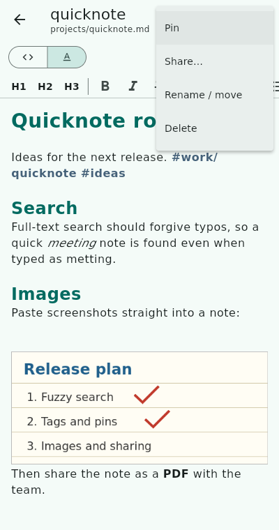

## Images

Add an image to a note and TurboNotes saves it next to the note and links it
at the cursor. The image button next to **Save** works in the Raw and the
WYSIWYG editor:

- **On Android** it opens a menu:
  - **Gallery** picks one or more images from your photos (up to 20 at a
    time). HEIC photos are saved as JPEG.
  - **Camera** opens your camera app; the photo you take goes into the note.
    TurboNotes needs no camera permission for this.
  - **Clipboard** pastes a copied image (a screenshot, an image from the
    browser).

  Keyboards that insert images, such as Gboard's clipboard, work too.
- **On the Linux desktop** the button pastes the image on the clipboard, and
  so does `Ctrl+V` when the clipboard holds an image and no text.

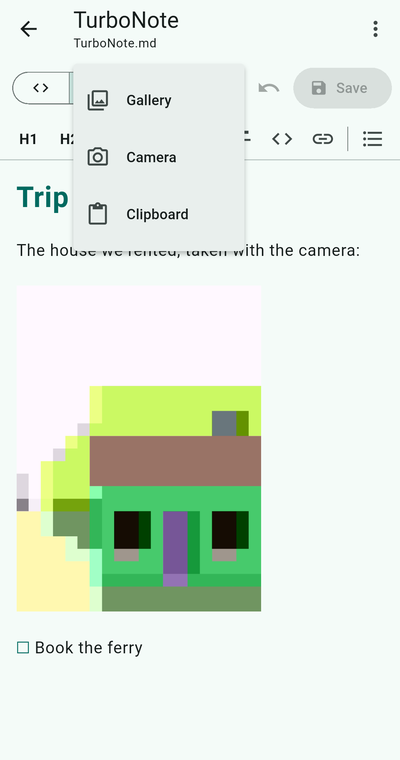

The image is saved right next to the note, in the same folder, named after
the note and the time, for example `projects/roadmap-20261007-193012.png`
for the note `projects/roadmap.md`. The note gets a
Markdown image link to it on a line of its own:

```markdown

```

The WYSIWYG editor shows the image in place, up to 320 pixels high. When the
cursor is on the image's line, the line shows its Markdown link instead, so
you can add a description between the brackets or delete the image like any
other text. The Raw editor always shows the link.

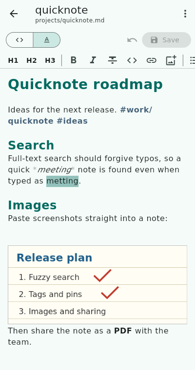

Images you add by hand show up the same way, as long as the link points to a
`.png`, `.jpg`, `.jpeg`, `.gif` or `.webp` file inside the notes folder,
relative to the note. Images on the web are not loaded: TurboNotes never
touches the network. Deleting the link does not delete the image file.

## Saving

You rarely have to think about saving. TurboNotes saves a note's edits
automatically:

- when you open another note,
- when you go back to the tree on a phone,
- before renaming the open note, and before opening Preferences,
- when the app goes to the background (on a phone: switching apps or
  locking the screen),
- when the window is closed.

To save right away, use the Save button or `Ctrl+S`. **Revert** (the undo
arrow next to it) throws away the edits since the last save.

Saving writes back to the same file. On a plain folder it writes to a
temporary file first and then renames it into place, so a crash or a full disk
never leaves half a note behind.

### When a note changed on disk

If a note was changed outside TurboNotes since you opened it, for example
because Syncthing delivered an edit from your laptop, saving it would
silently throw away that change. So TurboNotes asks first:

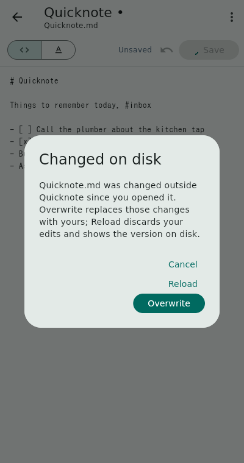

- **Cancel** keeps your edits in the editor and leaves the file alone.
- **Reload** throws away your edits and shows the version on disk.
- **Overwrite** replaces the version on disk with yours.

When TurboNotes has to save with nobody there to ask (the app went to the
background or the window was closed), it never overwrites the changed note.
It writes your edits to a copy next to it instead, named after the note and
the time, for example `todo (conflict 2026-10-07 184013).md`, and tells you
so. Compare the two and merge them by hand.

## Creating, renaming and deleting notes

**New note** (`Ctrl+N`) asks for a path. It starts with the folder of the
open note, so a new note lands next to the one you are reading.

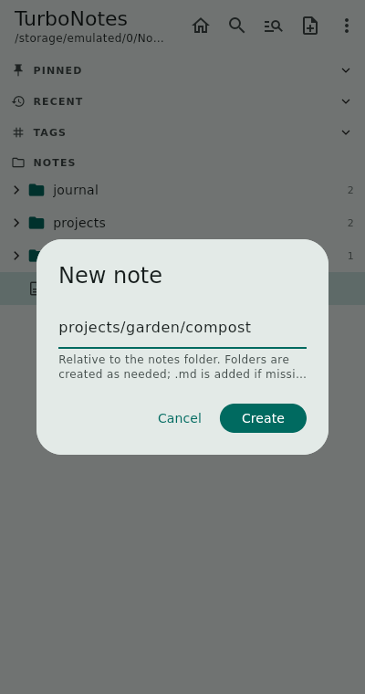

- Type a path such as `projects/garden/compost`; missing folders are created.
- `.md` is added unless the name already ends in `.md` or `.markdown`.
- TurboNotes never overwrites an existing note; it tells you if the name is
  taken.

The new note starts with a heading made from its name and opens with the
cursor at the end.

**Rename / move** (⋮ menu, or long-press the note in the tree) takes a new
path. Change the folder part to move the note. Unsaved edits are saved first.

**Delete** asks for confirmation and then deletes the file. There is no
trash, so a deleted note is gone unless your sync tool keeps old versions.

Empty folders are not shown in the tree. TurboNotes does not delete folders;
remove empty ones with your file manager if you like.

## Sharing a note

**Share…** in a note's ⋮ menu, or in the long-press menu in the tree, sends
the note to another app. Pick a format first:

- **As text**: the Markdown source.
- **As PDF**: the note as it looks in the WYSIWYG editor, images included,
  on A4 pages.
- **As image**: the whole note as one tall PNG, handy for chat apps.

On Android the usual share sheet opens next, to send the note to mail, chat,
Drive and so on. On the Linux desktop, text goes to the clipboard and PDFs
and images are saved to your Downloads folder, with a button to open them.

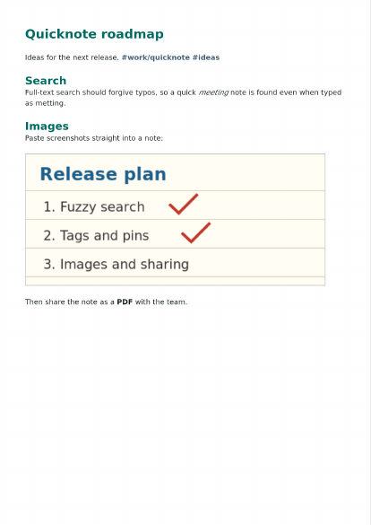

## Quick capture on Android

Two ways to jot something down without opening TurboNotes. Both add to the
[default note](#the-default-note).

**Home-screen widget.** Long-press the home screen, choose *Widgets* and add
**Quick note**. Tap the widget's text and a small dialog opens over the home
screen, titled *Add to TurboNote.md*. Type, then tap **Add**: the text goes
to the end of the default note as a paragraph of its own, and the dialog
closes. **Open app** opens the note in TurboNotes instead; the widget's icon
does the same.

**Share target.** In any app, share text or images and pick **Quick note**.
The same dialog opens with the shared text filled in, so you can edit it
before adding it. Shared images are saved right next to the default note
and linked in it, as with [pasted images](#images).

The text is added even when TurboNotes has the default note open: the note
reloads with the new text when you return to it, or you are asked as in
[When a note changed on disk](#when-a-note-changed-on-disk) if you had
unsaved edits.

## Preferences

Open **Preferences** from the ⋮ menu. Press the check mark to save, or go
back to discard the changes.

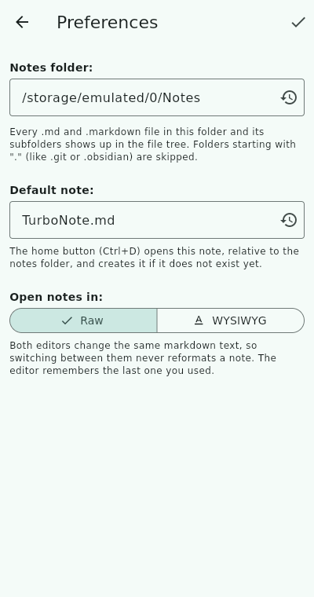

- **Notes folder**: the folder TurboNotes works on. Type a path, or use the
  reset button to go back to the default. A red card warns when TurboNotes
  cannot write to the folder. A folder that does not exist yet is created.
- **Default note**: the note the [lightning bolt button](#the-default-note)
  opens, relative to the notes folder. The reset button sets it back to
  `TurboNote.md`.
- **Open notes in**: the editor notes open in. This also changes whenever you
  switch editors on a note.
- **Vi keys in the editor** (Linux only): edit notes with vi's modal keys;
  see [Vi keys](#vi-keys).

On Android, Preferences also has **Choose folder with Android picker** and a
menu of common folders; see below.

## Storage on Android

By default notes live in the app's own folder,
`/Android/data/org.buetow.turbonotes/files/`. It needs no permission, but
Android deletes it when the app is uninstalled.

For an existing notes folder, for example one Syncthing syncs, there are two
ways:

- **Choose folder with Android picker** (recommended): pick the folder in the
  system picker. Android then grants TurboNotes access to that folder only, and
  no storage permission is needed.
- **Type a path** into shared storage, such as `/storage/emulated/0/Notes`.
  This needs the Storage permission on Android 7 to 10, or "All files access"
  on Android 11 and later. Preferences says so and opens the setting when the
  folder is not writable.

## Keyboard shortcuts

With a keyboard, on a tablet or the Linux desktop:


| Shortcut | Action |
|----------|--------|
| `Ctrl+D` | Open the default note |
| `Ctrl+P`, `Ctrl+K` | Fuzzy finder |
| `Ctrl+Shift+F` | Full-text search |
| `Ctrl+N` | New note |
| `F5` | Refresh the tree |
| `Ctrl+S` | Save |
| `Ctrl+E` | Switch between Raw and WYSIWYG |
| `Ctrl+B` / `Ctrl+I` | Bold / italics |
| `Ctrl+V` | Paste text, or an image when the clipboard holds no text |
| In the finder and search: arrows, `Ctrl+N` / `Ctrl+P`, `Ctrl+J` / `Ctrl+K`, `Page Up` / `Page Down` | Move through the matches |
| In the finder and search: `Enter` / `Esc` | Open the note / close |
| In the editor: `Esc` (with vi keys: `Ctrl+W h`) | Back to the sidebar; edits stay, unsaved until you save or leave the note |

The sidebar also has [vi-style keys](#the-sidebar), always on.

## Vi keys

TurboNotes can be driven from the keyboard the way vi and Vim are: the
sidebar always takes vi-style keys, and the editor takes vi's modal keys once
you turn on **Vi keys in the editor** in [Preferences](#preferences). This
needs a hardware keyboard, so the editor switch is only offered on Linux.

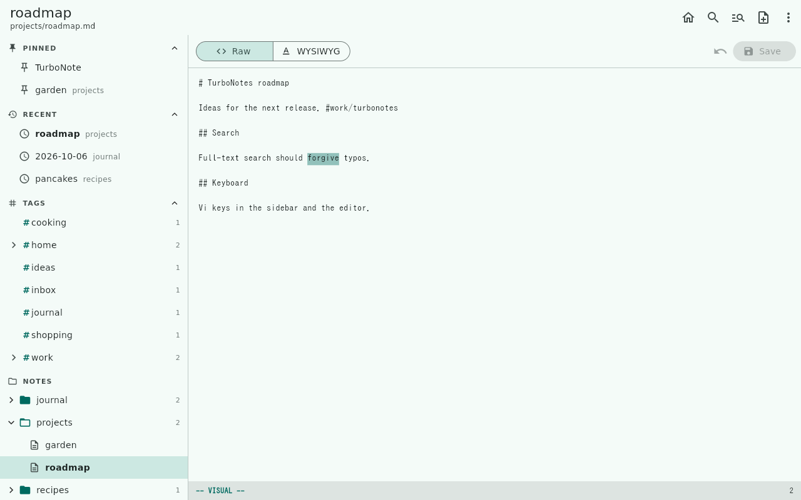

### The sidebar

Whenever no text field has the keyboard, the sidebar does. The first key you
press shows its cursor, an outlined row.

| Key | Action |
|-----|--------|
| `j` / `k` (or the arrows) | Next / previous row; `5j` moves five |
| `gg` / `G` | First / last row |
| `l` (or Right) | Open a folder, tag or section; on an open one, go to its first entry |
| `h` (or Left) | Close a folder, tag or section; elsewhere, go to its parent |
| `Enter`, `o`, `Space` | Open the note and move the keyboard into it; on a folder, open or close it |
| `i`, `Ctrl+W l` | Into the open note's editor, the caret where it was |
| `/` | [Fuzzy finder](#fuzzy-finder) |
| `?` | [Full-text search](#full-text-search) |
| `a` | New note, in the folder under the cursor |
| `r` / `d` | Rename / delete the note under the cursor (delete still asks) |
| `p` | Pin or unpin it |
| `s` | Share it |
| `m` | Its menu |
| `R` | Refresh |
| `W` | Collapse all folders |
| `Esc` | Drop the tag filter |

On a tag, `Enter` filters the tree by it and `l` opens its sub-tags.

### The editor

With **Vi keys in the editor** on, a note opens in *normal mode*: keys are
commands and nothing you press types into the note. A status line under the
note shows the mode (`-- NORMAL --`, `-- INSERT --`, `-- VISUAL --`) and the
command typed so far. The cursor is a block on a character.

Both the Raw and the WYSIWYG editor take these keys; they work on the
Markdown source, so in WYSIWYG a hidden `**` still counts as two characters.

Entering and leaving insert mode:

| Key | Action |
|-----|--------|
| `i` / `a` | Insert before / after the cursor |
| `I` / `A` | Insert at the start / end of the line |
| `o` / `O` | Open a line below / above, with the same indent |
| `Esc`, `Ctrl+[` | Back to normal mode |

Moving (all take a count, like `3w`):

| Key | Action |
|-----|--------|
| `h` `j` `k` `l` | Left, down, up, right |
| `w` `b` `e`, `W` `B` `E` | Next word, previous word, end of word; capitals skip punctuation |
| `0` `^` `$` | Start of line, first non-blank, end of line |
| `gg`, `G`, `5G` | First line, last line, line 5 |
| `{` `}` | Previous / next blank line |
| `f`x `F`x `t`x `T`x, `;` `,` | To (or just before) the next or previous `x` on the line, and repeat |
| `%` | The matching bracket |
| `Enter`, `-` | First non-blank of the next / previous line |

Editing:

| Key | Action |
|-----|--------|
| `d`, `c`, `y` + a motion | Delete, change, copy: `dw`, `c$`, `y2j`, `dG` |
| `dd`, `cc`, `yy` (`Y`) | The whole line; `3dd` three lines |
| `D`, `C` | Delete / change to the end of the line |
| `x`, `X`, `s`, `S` | Delete the character under / before the cursor; change it; change the line |
| `iw` `aw`, `i"` `a"`, `i(` `a(`, `i[`, `i{`, `i<` | Text objects after an operator: `ciw`, `da"`, `di(` |
| `p`, `P` | Put after / before (a whole line goes below / above) |
| `r`x | Replace the character with `x` |
| `J` | Join the next line onto this one |
| `>>`, `<<` | Indent / outdent the line by two spaces, as nested lists need |
| `~` | Switch the case |
| `u`, `Ctrl+R` | Undo, redo; a whole command or insert counts as one step |

Selecting: `v` selects characters, `V` whole lines; move to grow the
selection, `o` jumps to its other end, and `iw` and the other text objects
select those. Then `d` (or `x`), `c`, `y`, `>`, `<`, `J`, `~`, `u` (lower
case) or `U` (upper case). A selection made with the mouse works the same.

Searching and commands, typed in the status line (`Enter` runs, `Esc`
cancels):

| Key | Action |
|-----|--------|
| `/`text, `?`text | Search forward / backward, wrapping around |
| `n`, `N` | Next match, in the same / other direction |
| `*`, `#` | Search for the word under the cursor |
| `:w` | Save |
| `:q` | Leave the note: back to the sidebar (on a phone-sized window the note closes and saves) |
| `:wq`, `:x` | Save, then leave |
| `:42` | Go to line 42 |

Search is plain text, not a regular expression, and ignores case unless the
text has a capital letter. Text you copy with `y` also goes to the system
clipboard. `Ctrl+S`, `Ctrl+V`, `Ctrl+E` and the other shortcuts above keep
working in normal mode, and `Ctrl+W h` goes back to the sidebar.

## Why the WYSIWYG editor works the way it does

The Flutter editors that turn Markdown into their own document model and back
(AppFlowy Editor, Super Editor) do not compile against current Flutter, and
the one that does (Quill) loses formatting on the way back: it escapes
punctuation, drops blank lines and flattens tables. For a tool whose whole job
is editing notes you already have, a save that reformats them is not
acceptable.

So TurboNotes's WYSIWYG editor is a formatted *view* of the Markdown source.
What you type is the Markdown; the editor only changes how it is painted. That
is why switching editors, or saving from either one, never changes a note's
formatting, and why the syntax reappears on the line you are editing.
