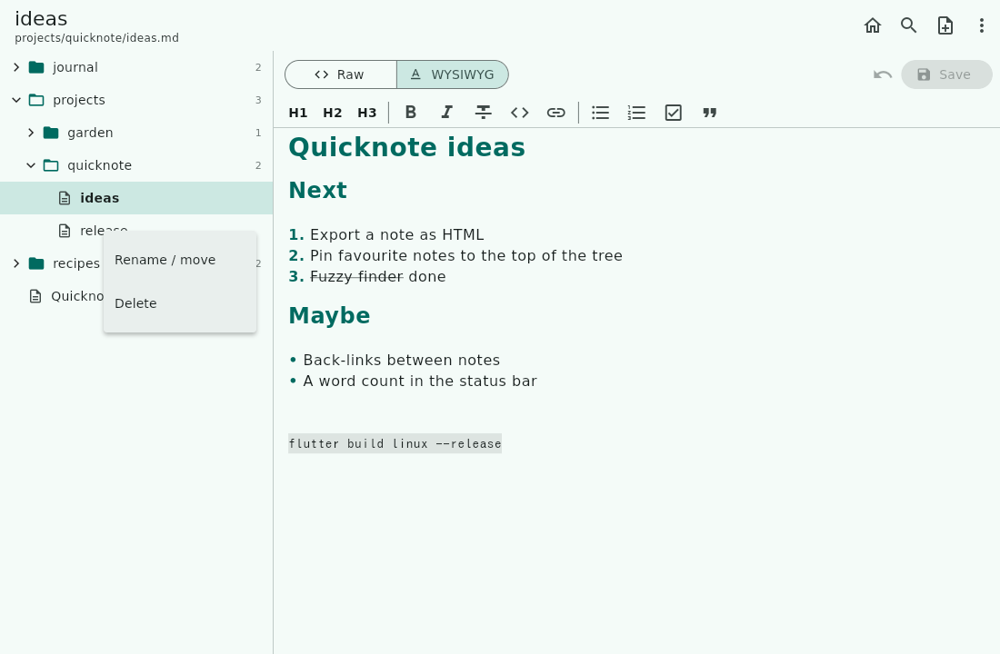
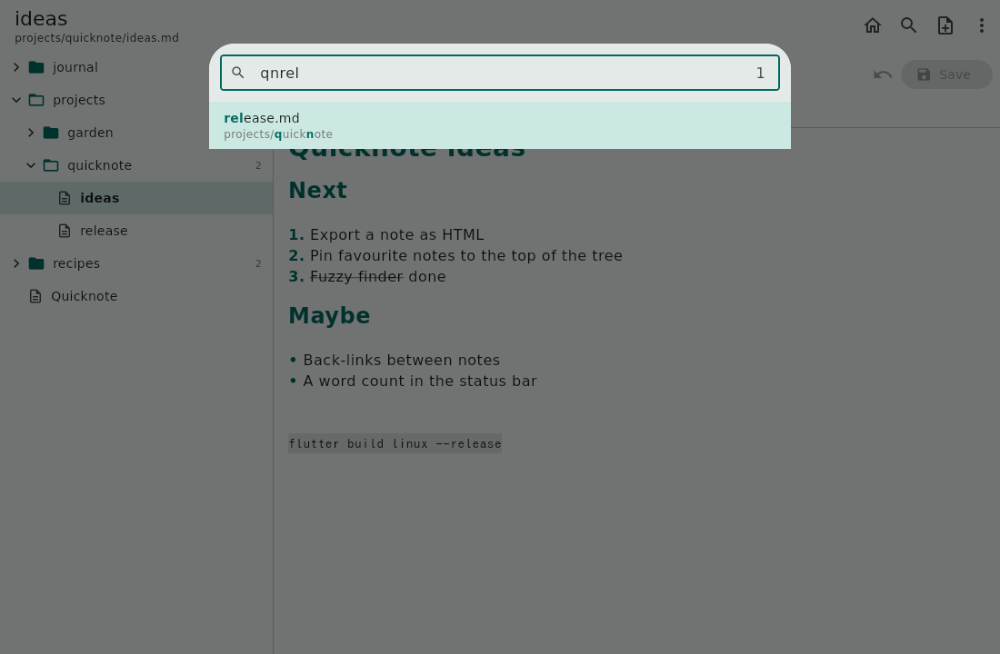
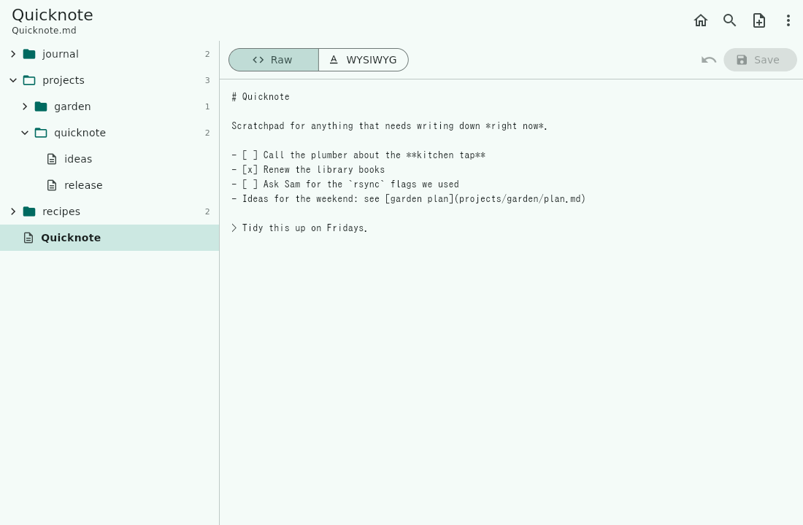
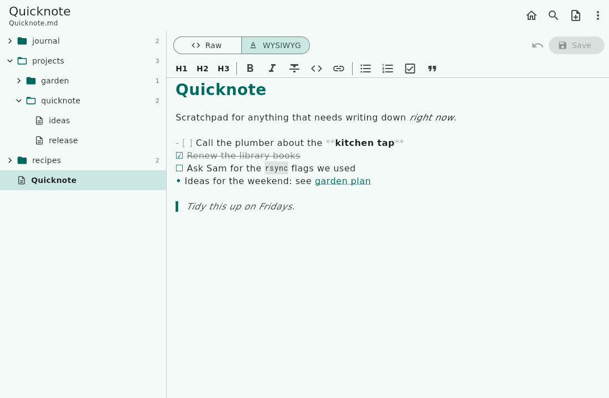
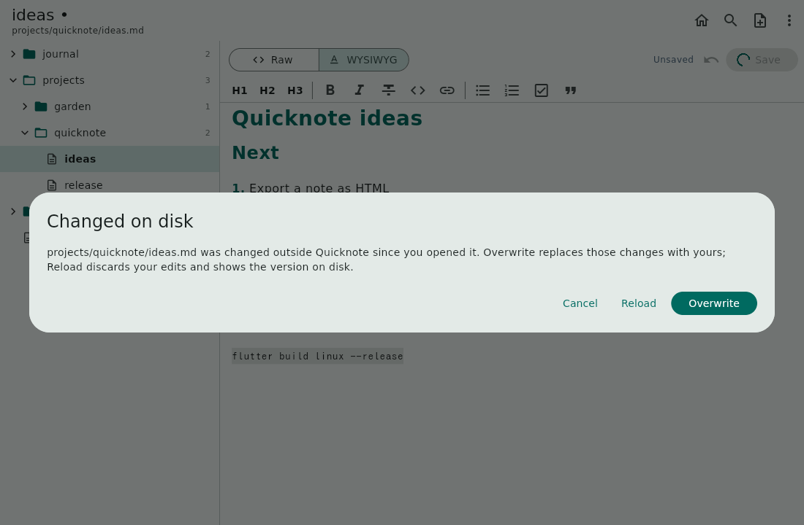
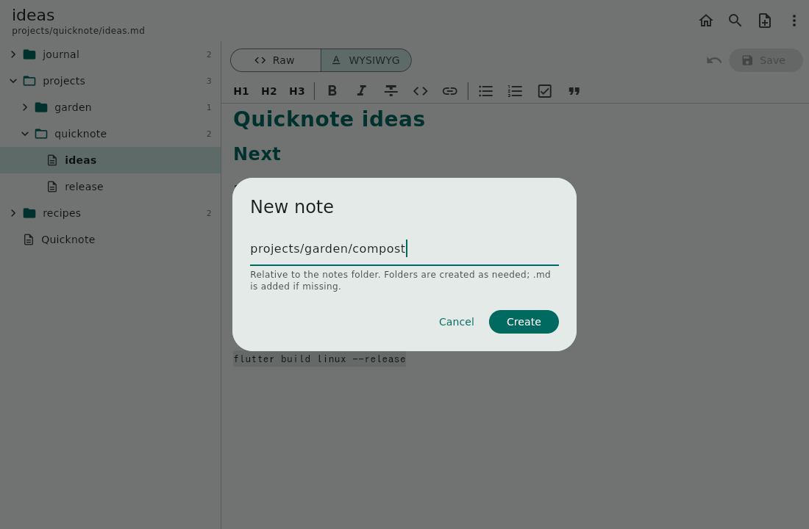
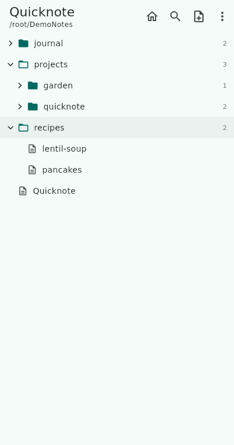
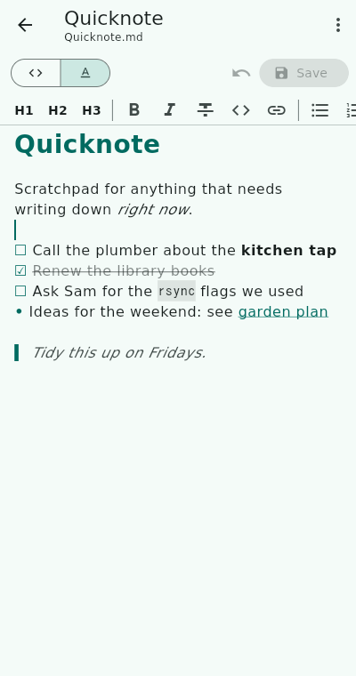
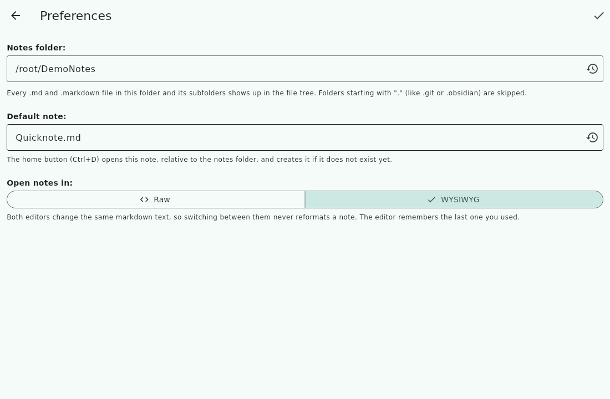

# Quicknote usage guide

Quicknote edits a folder of plain Markdown files. This guide walks through
everything it does. The screenshots are from the Linux build; the Android app
looks the same, with the phone layout described in [On a phone](#on-a-phone).

- [The notes folder](#the-notes-folder)
- [The main window](#the-main-window)
- [The default note](#the-default-note)
- [Finding notes](#finding-notes)
- [Editing](#editing)
- [Saving](#saving)
- [Creating, renaming and deleting notes](#creating-renaming-and-deleting-notes)
- [On a phone](#on-a-phone)
- [Preferences](#preferences)
- [Storage on Android](#storage-on-android)
- [Keyboard shortcuts](#keyboard-shortcuts)
- [Why the WYSIWYG editor works the way it does](#why-the-wysiwyg-editor-works-the-way-it-does)

## The notes folder

Quicknote works on one folder at a time, the *notes folder*. Every `.md` and
`.markdown` file in it, and in all of its subfolders, is a note. Everything
else is ignored:

- Other file types are not listed and never touched.
- Folders whose name starts with `.` (`.git`, `.obsidian`, `.stfolder`,
  `.trash`) are skipped, so a Git repository or an Obsidian vault works as a
  notes folder as is.
- Symbolic links are not followed.

On first start the notes folder is `~/Notes` on Linux and the app's own
folder on Android (see [Storage on Android](#storage-on-android)). It is
created if it does not exist. Change it in [Preferences](#preferences).

Quicknote has no sync of its own and no network access at all. To have the
same notes on several devices, point it at a folder that a sync tool such as
Syncthing keeps in sync.

## The main window

On a wide screen the window has two panes:

- **Left: the file tree** of the notes folder. Folders come first, each with
  the number of notes it holds (counting subfolders). Click a folder to open
  or close it, click a note to open it.
- **Right: the open note**, in the Raw or WYSIWYG editor.

The title bar shows the open note's name and its path in the notes folder. A
`•` after the name means it has unsaved edits. The buttons on the right are,
from left to right:

| Button | What it does |
|--------|--------------|
| Home | Opens the [default note](#the-default-note) (`Ctrl+D`) |
| Search | Opens the [fuzzy finder](#fuzzy-finder) (`Ctrl+P`) |
| New note | [Creates a note](#creating-renaming-and-deleting-notes) (`Ctrl+N`) |
| ⋮ menu | Refresh, Collapse all folders, Rename / move note, Delete note, Preferences, About |

**Refresh** (`F5`) re-reads the notes folder. Quicknote also refreshes on its
own whenever you come back to the app, so notes another device synced in the
meantime show up.

## The default note

The home button, or `Ctrl+D`, opens the default note, `Quicknote.md` at the
top of the notes folder. It is meant as a scratchpad for anything that needs
writing down *now*: it opens with the cursor at the end, ready for typing.

If the note does not exist yet, the home button creates it with a
`# Quicknote` heading. Pressing the button while the note is already open
puts the cursor back at its end.

To use another note, change **Default note** in
[Preferences](#preferences), for example to `journal/inbox.md`. The path is
relative to the notes folder; `.md` is added if you leave it out, and missing
folders are created along with the note.

## Finding notes

### File tree

Click a folder to open or close it. **Collapse all folders** in the ⋮ menu
closes them all. Opening a note in any other way, such as the fuzzy finder,
opens the folders on its path so that it is visible in the tree.

Right-click a note (long-press on a touch screen) for **Rename / move** and
**Delete**:

### Fuzzy finder

The search button, `Ctrl+P` or `Ctrl+K` opens the fuzzy finder. Type a few
letters of a note's path, in order, and it lists the notes that match, best
first. The letters do not have to be next to each other: `qnrel` finds
`projects/quicknote/release.md`. Matched letters are highlighted.

- Matches in the file name rank above matches in folder names, and letters at
  the start of a word or right after each other rank higher.
- Separate words with spaces to require all of them, in any order:
  `garden plan`.
- Use the arrow keys, `Ctrl+N` / `Ctrl+P` or `Page Up` / `Page Down` to move
  through the list, and `Enter` or a click to open a note. `Esc` closes the
  finder.
- The count on the right shows how many notes match.

## Editing

Every note can be edited in two editors. The Raw / WYSIWYG switch above the
note, or `Ctrl+E`, flips between them. Both edit the same Markdown text, so
switching is instant and never changes the file. Quicknote remembers the
editor you used last and opens notes in it.

### Raw

The Markdown source exactly as it is on disk, in a monospace font. Nothing is
hidden or changed.

### WYSIWYG

Markdown shown formatted while you type: headings, **bold**, *italics*,
~~strikethrough~~, `inline code`, links, bullet and numbered lists, tasks,
quotes, fenced code blocks, tables and horizontal rules.

The Markdown syntax characters (`#`, `**`, `- [ ]` and so on) are hidden,
except on the line the cursor is on, where they show dimmed so that you can
see and edit them, like Typora or Obsidian's live preview:

The toolbar above the note inserts Markdown for you. With text selected,
bold, italics, strikethrough and code wrap the selection; pressing a button
again removes the formatting.

| Button | Inserts |
|--------|---------|
| H1, H2, H3 | `#`, `##`, `###` heading (press again to remove) |
| **B** | `**bold**` (`Ctrl+B`) |
| *I* | `*italics*` (`Ctrl+I`) |
| S | `~~strikethrough~~` |
| `<>` | `` `inline code` `` |
| Link | `[text](https://)`, with the selection as the text and the URL selected for typing |
| Bulleted / numbered list | `- ` / `1. ` at the start of the line |
| Task | `- [ ] `; on a task line it ticks or unticks it |
| Quote | `> ` at the start of the line |

Press `Enter` at the end of a list item and the next line continues the list:
the same bullet, the next number, or a new open task. `Enter` on an empty
item ends the list.

`Ctrl+B` and `Ctrl+I` also work in the Raw editor.

## Saving

You rarely have to think about saving. Quicknote saves a note's edits
automatically:

- when you open another note,
- when you go back to the tree on a phone,
- before renaming the open note, and before opening Preferences,
- when the app goes to the background (on a phone: switching apps or
  locking the screen),
- when the window is closed.

To save right away, use the Save button or `Ctrl+S`. **Revert** (the undo
arrow next to it) throws away the edits since the last save.

Saving writes back to the same file. On a plain folder it writes to a
temporary file first and then renames it into place, so a crash or a full disk
never leaves half a note behind.

### When a note changed on disk

If a note was changed outside Quicknote since you opened it, for example
because Syncthing delivered an edit from your laptop, saving it would
silently throw away that change. So Quicknote asks first:

- **Cancel** keeps your edits in the editor and leaves the file alone.
- **Reload** throws away your edits and shows the version on disk.
- **Overwrite** replaces the version on disk with yours.

When Quicknote has to save with nobody there to ask (the app went to the
background or the window was closed), it never overwrites the changed note.
It writes your edits to a copy next to it instead, named after the note and
the time, for example `todo (conflict 2026-10-07 184013).md`, and tells you
so. Compare the two and merge them by hand.

## Creating, renaming and deleting notes

**New note** (`Ctrl+N`) asks for a path. It starts with the folder of the
open note, so a new note lands next to the one you are reading.

- Type a path such as `projects/garden/compost`; missing folders are created.
- `.md` is added unless the name already ends in `.md` or `.markdown`.
- Quicknote never overwrites an existing note; it tells you if the name is
  taken.

The new note starts with a heading made from its name and opens with the
cursor at the end.

**Rename / move** (⋮ menu, or right-click the note in the tree) takes a new
path. Change the folder part to move the note. Unsaved edits are saved first.

**Delete** asks for confirmation and then deletes the file. There is no
trash, so a deleted note is gone unless your sync tool keeps old versions.

Empty folders are not shown in the tree. Quicknote does not delete folders;
remove empty ones with your file manager if you like.

## On a phone

On a narrow screen the tree fills the screen, and a note opens on a screen of
its own. Back returns to the tree and saves the note on the way. The editor's
Raw and WYSIWYG switch shows icons only to save room.

| Tree | Note |
|------|------|
|  |  |

The note screen's ⋮ menu has **Rename / move** and **Delete**. Pull the tree
down to refresh it.

## Preferences

Open **Preferences** from the ⋮ menu. Press the check mark to save, or go
back to discard the changes.

- **Notes folder**: the folder Quicknote works on. Type a path, or use the
  reset button to go back to the default. A red card warns when Quicknote
  cannot write to the folder. A folder that does not exist yet is created.
- **Default note**: the note the [home button](#the-default-note) opens,
  relative to the notes folder. The reset button sets it back to
  `Quicknote.md`.
- **Open notes in**: the editor notes open in. This also changes whenever you
  switch editors on a note.

On Android, Preferences also has **Choose folder with Android picker** and a
menu of common folders; see below.

## Storage on Android

By default notes live in the app's own folder,
`/Android/data/org.buetow.quicknote/files/`. It needs no permission, but
Android deletes it when the app is uninstalled.

For an existing notes folder, for example one Syncthing syncs, there are two
ways:

- **Choose folder with Android picker** (recommended): pick the folder in the
  system picker. Android then grants Quicknote access to that folder only, and
  no storage permission is needed.
- **Type a path** into shared storage, such as `/storage/emulated/0/Notes`.
  This needs the Storage permission on Android 7 to 10, or "All files access"
  on Android 11 and later. Preferences says so and opens the setting when the
  folder is not writable.

## Keyboard shortcuts

| Shortcut | Action |
|----------|--------|
| `Ctrl+D` | Open the default note |
| `Ctrl+P`, `Ctrl+K` | Fuzzy finder |
| `Ctrl+N` | New note |
| `F5` | Refresh the tree |
| `Ctrl+S` | Save |
| `Ctrl+E` | Switch between Raw and WYSIWYG |
| `Ctrl+B` / `Ctrl+I` | Bold / italics |
| In the finder: arrows, `Ctrl+N` / `Ctrl+P`, `Page Up` / `Page Down` | Move through the matches |
| In the finder: `Enter` / `Esc` | Open the note / close |

## Why the WYSIWYG editor works the way it does

The Flutter editors that turn Markdown into their own document model and back
(AppFlowy Editor, Super Editor) do not compile against current Flutter, and
the one that does (Quill) loses formatting on the way back: it escapes
punctuation, drops blank lines and flattens tables. For a tool whose whole job
is editing notes you already have, a save that reformats them is not
acceptable.

So Quicknote's WYSIWYG editor is a formatted *view* of the Markdown source.
What you type is the Markdown; the editor only changes how it is painted. That
is why switching editors, or saving from either one, never changes a note's
formatting, and why the syntax reappears on the line you are editing.
